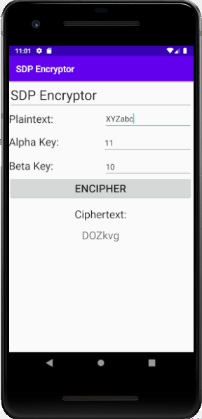
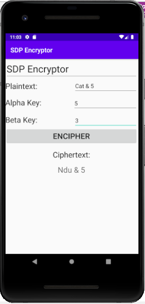
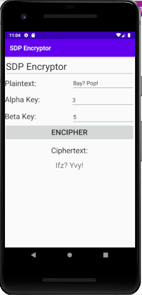
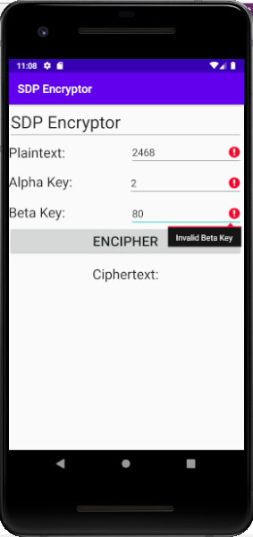

# Encryptor User Manual

**Author**: Teng (Elijah) Xue

## Introduction

A simple Affine Cipher app for Android system, allows users to encrypt messages using a simple substitution cipher. 

## Getting Started

### Dependencies
* The minimum SDK for the app is API 28: Android 9.0 (Pie).
* The application must be run on a phone equivalent to AVD Pixel_2_API_28 emulator.

## Main Features

### Input 
* A plaintext message (Must be a ​non-empty string ​and contain ​at least one letter).
* An alpha key number (first encryption parameter, an ​integer ​coprime​ to 26 between 0 and 26).
* A beta key number (Second encryption parameter, an ​integer butween 1 (included) and 26 (not included).

### Output
* Each letter in the alphabet is assigned a numeric value between 0 and 25 based on its position in the alphabet (i.e., A=0, a=0, B=1, b=1, …, Z=25, z=25).For each letter in the alphabet, where the numeric value is ​x​, the encrypted value of the letter is defined as ​E(x) = ​(​αx ​+ ​β​) % 26 where ​α ​and ​β ​are the values of Alpha Key and Beta Key respectively, as in an ​Affine Cipher​.
* The encrypted character for the input letter is calculated by taking the encrypted number, which is a value between 0 and 25, and translating it back into a letter (again, where A=0, a=0, B=1, b=1, …, Z=25, z=25) with the original capitalization. All non-alphabetic characters must remain unchanged.
* After click the "ENCIPHER” button, the encrypt message should be shown on the screen.If any input is invalid when the button is pressed, the output should then be set to the empty string, and all applicable error messages should be generated (see below).

### Error
* “​Invalid Plaintext​”, related to the ​Plaintext ​field, for an empty or letterless entry.
* “​Invalid Alpha Key​”, related to the ​Alpha Key ​field, for a blank or unacceptable value (i.e., not coprime to 26).
* “​Invalid Beta Key​”, related to the ​Beta Key ​field, for a blank or out-of-range value.
